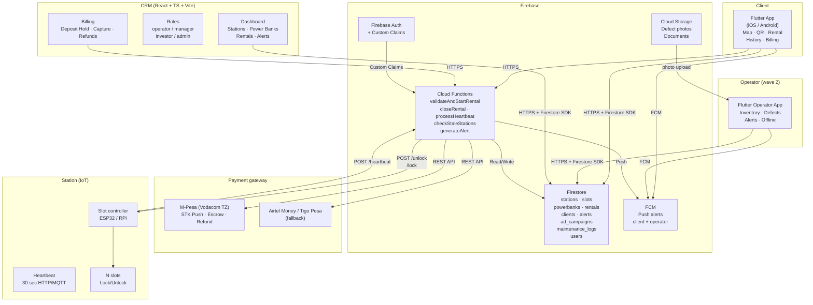
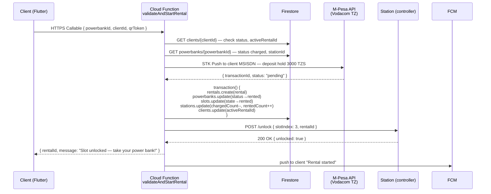
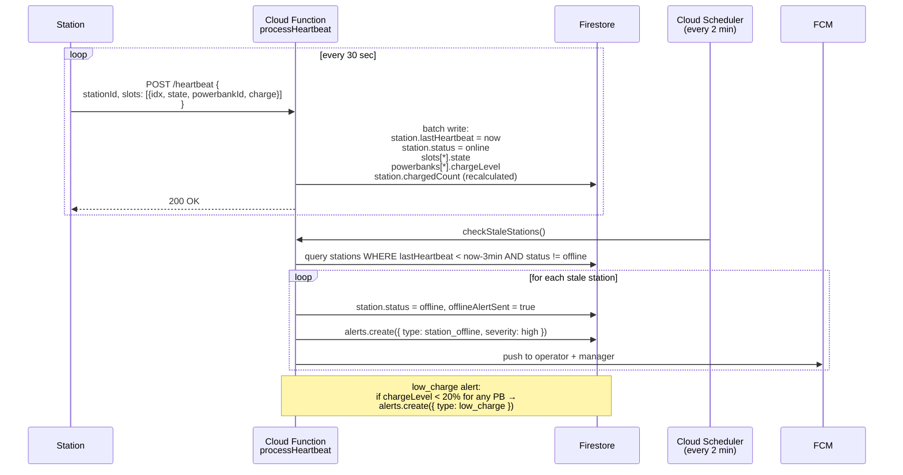
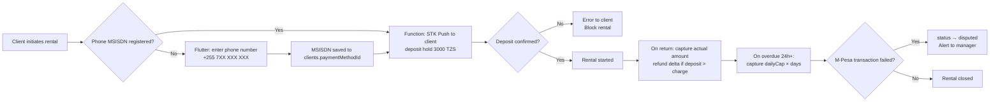

# VOLT · Power Bank Sharing System — Architecture

> Version 1.0 · Author: Aleksandr Sokolov · 2026-06-10  
> Status: **MVP Design Document** — covers pilot on 1 station and roadmap to network scale.

---

## 1. Summary

We are building a power bank rental platform: the client scans a QR code on the station → picks up a power bank → returns it to any station in the network → billing is automatic. Backend — Firebase (Firestore + Cloud Functions + FCM), frontends — Flutter (client + operator) and React/TS (CRM). The stack was chosen for launch speed: Firestore provides realtime without a custom WebSocket, Functions handle business logic without DevOps overhead, Flutter delivers a single codebase for iOS/Android. MVP in 3–4 weeks covers: station → rental → return → billing → alerts → CRM with roles. Advertising, the operator app, and analytics are wave 2: they do not block the first commercial transaction, but the architecture accommodates them from day one.

**Assumption:** until real hardware is available, the station emulator on Node/Functions unblocks the full development cycle.

---

## 2. High-Level Architecture

### 2.1 System Components



### 2.2 Data flow map

| Source | Destination | Mechanism |
|---|---|---|
| Station → server | Cloud Functions `/heartbeat` | HTTP POST every 30 sec |
| Server → station | REST command `/unlock`, `/lock` | HTTP POST (response to rental) |
| Client → rental | `validateAndStartRental` Function | HTTPS Callable |
| Functions → CRM/App | Firestore realtime listeners | Firestore SDK onSnapshot |
| Functions → operator | FCM push | FCM Admin SDK |
| Payment | M-Pesa callback → Function | HTTPS POST |

---

## 3. Firestore Data Model

### 3.1 Principles

**Denormalization is justified** in three places:
1. `stations/{id}` stores counters `chargedCount` / `depletedCount` / `totalSlots` — updated transactionally from Functions. The alternative (on-the-fly aggregation) across 50 stations × realtime generates unnecessary reads and overhead.
2. `rentals/{id}` stores `clientPhone` (masked) and `stationAddress` — needed for operator search without a join.
3. `clients/{id}` stores `activeRentalId` — instant answer to "is there an active rental?" without querying rentals.

**Serial number convention:** `PB-YYMM-NNNNN` (example: `PB-2406-00042`). Station: `ST-YYMM-NNN`.

**Power bank health:** `health = max(100 − cycles × 0.05, 10)`. When `health < 30` — flag `needsMaintenance: true`, alert to operator.

---

### 3.2 Collections

#### `stations`

```jsonc
// stations/{stationId}
{
  "stationId": "ST-2406-001",
  "name": "Mlimani City Mall · Level 1",
  "address": "Sam Nujoma Rd, Dar es Salaam",
  "location": { "_lat": -6.7690, "_long": 39.2340 },  // GeoPoint
  "totalSlots": 12,
  "chargedCount": 8,       // denormalized counter
  "depletedCount": 2,      // denormalized counter
  "rentedCount": 2,        // power banks currently rented out
  "status": "online",      // online | offline | maintenance
  "lastHeartbeat": "2026-06-10T10:15:00Z",  // Timestamp
  "offlineAlertSent": false,
  "ownerId": "user_mgr_001",  // manager uid
  "createdAt": "2026-06-01T00:00:00Z"
}
```

**Indexes:** `status` + `lastHeartbeat` (for cron offline detection), `ownerId` (for manager).

---

#### `stations/{stationId}/slots` (subcollection)

```jsonc
// stations/{stationId}/slots/{slotIndex}
{
  "slotIndex": 3,
  "state": "charged",      // charged | depleted | rented | empty | fault
  "powerbankId": "PB-2406-00042",  // null if empty
  "lockedAt": null,
  "updatedAt": "2026-06-10T10:10:00Z"
}
```

**Indexes:** `state` (filter available slots on rental).

---

#### `powerbanks`

```jsonc
// powerbanks/{powerbankId}
{
  "powerbankId": "PB-2406-00042",
  "serialNumber": "PB-2406-00042",
  "qrCode": "https://app.volt.tz/rent/PB-2406-00042",
  "status": "charged",     // charged | depleted | rented | lost | retired
  "chargeLevel": 98,       // % at last station heartbeat
  "cycles": 124,
  "health": 93.8,          // max(100 - 124*0.05, 10)
  "needsMaintenance": false,
  "currentStationId": "ST-2406-001",
  "currentSlotIndex": 3,
  "activeRentalId": null,  // null if docked at station
  "lastSeenAt": "2026-06-10T10:10:00Z",
  "createdAt": "2026-06-01T00:00:00Z"
}
```

**Indexes:** `status`, `currentStationId`, `needsMaintenance` + `status`.

---

#### `clients`

```jsonc
// clients/{clientId}   (clientId == Firebase Auth UID)
{
  "clientId": "uid_abc123",
  "phoneHash": "sha256(+255712345678+salt)",  // never store phone in plaintext
  "phoneMasked": "+255 71 ***-**-78",          // for CRM display
  "displayName": "Amina J.",
  "email": null,
  "paymentMethodId": "mpesa_msisdn_XXXX",  // M-Pesa MSISDN token or escrow ref
  "activeRentalId": "rental_001",          // null if no active rental
  "totalRentals": 14,
  "totalSpent": 30520,         // TZS, denormalized for investor view
  "status": "active",          // active | blocked | suspicious
  "createdAt": "2026-05-01T00:00:00Z",
  "lastActivityAt": "2026-06-10T09:00:00Z"
}
```

**Indexes:** `status`, `activeRentalId` (duplicate rental check).  
**PII note:** phone is stored as hash + mask only. Full number lives in encrypted field in a separate `client_pii` collection with strict Rules (access via admin Functions only).

---

#### `rentals`

```jsonc
// rentals/{rentalId}
{
  "rentalId": "rental_20260610_001",
  "clientId": "uid_abc123",
  "clientPhoneMasked": "+255 71 ***-**-78",  // denormalized for CRM
  "powerbankId": "PB-2406-00042",
  "startStationId": "ST-2406-001",
  "startSlotIndex": 3,
  "endStationId": null,       // filled on return
  "endSlotIndex": null,
  "startedAt": "2026-06-10T10:20:00Z",
  "endedAt": null,
  "durationMinutes": null,
  "startChargeLevel": 98,
  "endChargeLevel": null,
  "status": "active",         // active | completed | overdue | disputed
  "billingStatus": "held",    // held | captured | refunded | failed
  "holdAmount": 3000,         // TZS deposit
  "capturedAmount": null,     // actual charge on return
  "paymentId": "mpesa_txn_XXXX",
  "tariff": {
    "firstHour": 1500,
    "perHour": 800,
    "dailyCap": 7000
  },
  "currency": "TZS",
  "createdAt": "2026-06-10T10:20:00Z"
}
```

**Indexes:** `clientId` + `status`, `powerbankId` + `status`, `startedAt` (for reports), `status` + `startedAt` (overdue cron).

---

#### `alerts`

```jsonc
// alerts/{alertId}
{
  "alertId": "alert_001",
  "type": "station_offline",  // station_offline | low_charge | powerbank_fault | maintenance_due
  "severity": "high",          // low | medium | high | critical
  "stationId": "ST-2406-001",
  "powerbankId": null,
  "message": "Station ST-2406-001 has not responded for more than 3 minutes",
  "status": "open",            // open | acknowledged | resolved
  "assignedTo": null,          // operator uid
  "createdAt": "2026-06-10T10:00:00Z",
  "resolvedAt": null,
  "metadata": {}
}
```

**Indexes:** `status` + `severity`, `stationId` + `status`, `type` + `createdAt`.

---

#### `maintenance_logs`

```jsonc
// maintenance_logs/{logId}
{
  "logId": "log_001",
  "stationId": "ST-2406-001",
  "powerbankId": "PB-2406-00042",  // null if station-level log
  "operatorId": "uid_op_001",
  "type": "battery_replaced",  // battery_replaced | station_restart | defect_reported | inventory_check
  "description": "Replaced power bank PB-2406-00042, health < 30%",
  "photoUrls": ["gs://bucket/maintenance/log_001_photo1.jpg"],
  "beforeState": { "health": 28, "cycles": 380 },
  "afterState": { "health": 100, "cycles": 0 },
  "createdAt": "2026-06-10T11:00:00Z"
}
```

---

#### `ad_campaigns`

```jsonc
// ad_campaigns/{campaignId}
{
  "campaignId": "camp_001",
  "name": "Ramadan 2026 · Vodacom TZ",
  "advertiserId": "vodacom_tz",
  "slotType": "splash",        // splash | banner_history | banner_map
  "imageUrl": "gs://bucket/ads/vodacom_ramadan.jpg",
  "targetUrl": "https://vodacom.co.tz/promo",
  "targetStationIds": ["ST-2406-001", "ST-2406-002"],  // null = all stations
  "status": "active",          // draft | active | paused | completed
  "budget": 500000,            // TZS
  "cpmRate": 2000,             // TZS per 1000 impressions
  "impressionsTotal": 0,
  "impressionsCap": 250000,    // budget / cpmRate * 1000
  "frequencyCapMinutes": 3,    // max once per N min per device
  "startsAt": "2026-06-15T00:00:00Z",
  "endsAt": "2026-07-15T00:00:00Z",
  "createdAt": "2026-06-10T00:00:00Z"
}
```

---

#### `users` (staff)

```jsonc
// users/{uid}
{
  "uid": "uid_op_001",
  "email": "operator@volt.tz",
  "displayName": "Said Makame",
  "role": "operator",          // operator | manager | investor | admin
  "assignedStationIds": ["ST-2406-001"],  // for operator — their stations
  "isActive": true,
  "createdAt": "2026-06-01T00:00:00Z",
  "lastLoginAt": "2026-06-10T08:00:00Z"
}
```

---

### 3.3 Collection summary

| Collection | ~Doc count (pilot / scale) | Key indexes | Realtime? |
|---|---|---|---|
| `stations` | 1 / 500+ | `status+lastHeartbeat`, `ownerId` | Yes (CRM) |
| `slots` (sub) | 12 / 6000+ | `state` | Yes (CRM, operator) |
| `powerbanks` | 12 / 5000+ | `status`, `needsMaintenance+status` | On demand |
| `clients` | 10 / 100k+ | `status`, `activeRentalId` | No |
| `rentals` | 50 / 5M+ | `clientId+status`, `startedAt` | Active only |
| `alerts` | 5 / — | `status+severity`, `stationId+status` | Yes |
| `maintenance_logs` | 10 / — | `stationId`, `operatorId+createdAt` | No |
| `ad_campaigns` | 1 / 50 | `status+startsAt` | No |
| `users` | 3 / 200 | `role` | No |

---

## 4. Key Flows

### 4.1 QR Rental



**Important details:**
- The deposit hold is placed BEFORE the Firestore transaction. If Firestore fails after the hold — Function reverses the M-Pesa transaction.
- If the station does not respond to `/unlock` within 5 sec → rollback transaction + reverse deposit + error to client.
- Idempotency: `rentalId` is passed as the idempotency key in the M-Pesa request — safe to retry.

---

### 4.2 Power Bank Return

```mermaid
sequenceDiagram
    participant ST as Station (controller)
    participant F as Cloud Function<br/>closeRental
    participant FS as Firestore
    participant MP as M-Pesa API<br/>(Vodacom TZ)
    participant U as Client (Flutter)

    ST->>F: POST /insert { stationId, slotIndex, powerbankId, chargeLevel }
    F->>FS: GET powerbanks/{powerbankId} — activeRentalId
    F->>FS: GET rentals/{rentalId} — startedAt, holdAmount, tariff
    Note over F: durationMin = now - startedAt<br/>amount = calcAmount(durationMin, tariff)<br/>  = min( 1500 + max(0, ceil((dur-60)/60)) * 800, 7000 )<br/>refund = holdAmount - amount  (if amount < 3000)
    F->>MP: Capture actual amount; refund delta if deposit > charge
    MP-->>F: { status: "succeeded" }
    F->>FS: transaction() {<br/>  rentals.update(status→completed, endedAt, capturedAmount)<br/>  powerbanks.update(status→depleted, chargeLevel, currentStation)<br/>  slots.update(state→depleted)<br/>  stations.update(depletedCount++, rentedCount--)<br/>  clients.update(activeRentalId→null)<br/>}
    F-->>ST: 200 OK
    F->>U: FCM push "Return accepted, charged X TZS"
```

**Pricing function `calcAmount` (TZS):**

```
duration ≤ 60 min  → 1 500 TZS
duration > 60 min  → 1 500 + ceil((duration - 60) / 60) × 800 TZS
daily cap          → 7 000 TZS (1440 min)
deposit hold       → 3 000 TZS (refunded if charge < deposit)
```

| Duration | Amount |
|---|---|
| 30 min | 1 500 TZS |
| 60 min | 1 500 TZS |
| 90 min | 2 300 TZS |
| 3 hours | 3 900 TZS |
| 6 hours | 7 000 TZS (cap) |
| 24 hours | 7 000 TZS (cap) |

---

### 4.3 Station Heartbeat and Offline Detection



**Heartbeat protocol (station payload):**

```json
{
  "stationId": "ST-2406-001",
  "firmware": "1.2.3",
  "ts": 1749549300,
  "slots": [
    { "idx": 0, "state": "charged",  "powerbankId": "PB-2406-00001", "charge": 98 },
    { "idx": 1, "state": "depleted", "powerbankId": "PB-2406-00002", "charge": 11 },
    { "idx": 2, "state": "rented",   "powerbankId": null,            "charge": null },
    { "idx": 3, "state": "empty",    "powerbankId": null,            "charge": null }
  ]
}
```

---

### 4.4 Billing: M-Pesa + Mobile Money



**M-Pesa deposit model — trade-offs:**

Mobile money (M-Pesa, Airtel Money, Tigo Pesa) does not support a card-style pre-authorization hold natively. Two viable patterns:

| Pattern | How it works | Pros | Cons |
|---|---|---|---|
| **Deposit wallet (recommended)** | Client tops up an in-app wallet; rental debits the wallet; unused balance refundable | Clean UX, no per-rental STK push | Requires e-money licence or aggregator partnership |
| **STK Push + escrow** | STK Push collects full deposit (3 000 TZS) upfront; Function holds it in escrow field; refunds delta on return | No wallet licence needed; works with Vodacom B2B API | Two transactions per rental cycle; latency on STK confirmation |
| **Airtel / Tigo fallback** | Same STK Push pattern via Selcom or Azampay aggregator | Multi-operator coverage | Aggregator adds ~0.5–1% fee |

**Recommended for MVP:** STK Push + escrow via Vodacom M-Pesa Business API (requires TZ business registration). Selcom or Azampay as aggregator covers Airtel Money / Tigo Pesa without separate integrations.

**Idempotency:** M-Pesa does not guarantee exactly-once delivery. The Function checks `rentals/{rentalId}.billingStatus` before issuing a second STK Push — duplicate callbacks are safe to ignore.

---

## 5. Roles and Security

### 5.1 Access matrix

| Resource | operator | manager | investor | admin |
|---|---|---|---|---|
| Own stations: view | ✅ | ✅ | ✅ | ✅ |
| Other stations: view | ❌ | ✅ | ✅ (aggregates only) | ✅ |
| Station control (unlock/lock) | ✅ (own) | ✅ | ❌ | ✅ |
| Rental list | ✅ (own station, no PII) | ✅ (masked phone) | ❌ | ✅ (full PII) |
| Financials: rental amounts | ❌ | ✅ | ✅ (aggregates) | ✅ |
| Client profile (PII) | ❌ | masked | ❌ | ✅ |
| Role management | ❌ | ❌ | ❌ | ✅ |
| Alerts: view | ✅ (own) | ✅ | ❌ | ✅ |
| Alerts: close | ✅ (own) | ✅ | ❌ | ✅ |
| Ad campaigns | ❌ | ✅ | read | ✅ |
| Maintenance logs: write | ✅ | ✅ | ❌ | ✅ |
| Analytics / reports | ❌ | ✅ | ✅ (aggregates) | ✅ |

**Operator** sees only `assignedStationIds` — principle of least privilege.  
**Investor** never sees PII or individual rental details — only aggregate KPIs.

---

### 5.2 Firebase Auth + Custom Claims

When a user is created (via CRM admin) the Function sets the claim:

```js
await admin.auth().setCustomUserClaims(uid, {
  role: "operator",
  stationIds: ["ST-2406-001"]
});
```

The claim is embedded in the JWT token → validated in Firestore Rules and in Functions without an additional Firestore read.

---

### 5.3 Firestore Security Rules

```javascript
rules_version = '2';
service cloud.firestore {
  match /databases/{database}/documents {

    // Helper functions
    function isAuth() { return request.auth != null; }
    function role() { return request.auth.token.role; }
    function stationIds() { return request.auth.token.stationIds; }
    function isAdmin() { return role() == 'admin'; }
    function isManager() { return role() in ['admin', 'manager']; }

    // Stations: operator reads only their own; manager/investor — all
    match /stations/{stationId} {
      allow read: if isAuth() && (
        isAdmin() ||
        isManager() ||
        role() == 'investor' ||
        (role() == 'operator' && stationId in stationIds())
      );
      // Writes only via Functions (server-side), never from client
      allow write: if false;
    }

    // Rentals: operator sees only rentals for their station, no PII fields
    match /rentals/{rentalId} {
      allow read: if isAuth() && (
        isAdmin() ||
        isManager() ||
        // operator: only if startStationId is in their list
        (role() == 'operator' &&
         resource.data.startStationId in stationIds())
      );
      // clientPhoneMasked visible to operator; full PII is in client_pii only
      allow write: if false;
    }

    // Client PII — admin Functions only
    match /client_pii/{clientId} {
      allow read, write: if false; // access ONLY via Functions with Admin SDK
    }

    // Alerts: operator — own station only
    match /alerts/{alertId} {
      allow read: if isAuth() && (
        isAdmin() ||
        isManager() ||
        (role() == 'operator' &&
         resource.data.stationId in stationIds())
      );
      // Operator can update status→acknowledged/resolved for own alerts
      allow update: if isAuth() &&
        role() == 'operator' &&
        resource.data.stationId in stationIds() &&
        request.resource.data.diff(resource.data).affectedKeys()
          .hasOnly(['status', 'resolvedAt', 'assignedTo']);
    }

    // ad_campaigns: manager and admin only
    match /ad_campaigns/{campaignId} {
      allow read: if isAuth() && isManager();
      allow write: if isAuth() && isAdmin();
    }
  }
}
```

---

### 5.4 PII and Tanzania PDPA 2022

**Tanzania Personal Data Protection Act (PDPA 2022)** — enacted in 2022, establishes obligations for any controller processing personal data of Tanzanian residents. Key obligations relevant to VOLT:

- **Lawful basis**: explicit consent required before collecting phone numbers and usage data.
- **Data minimisation**: collect only what is necessary — phone (hashed), usage timestamps, payment reference. No biometrics in MVP scope.
- **Data subject rights**: right to access, correction, and erasure. The `client_pii` collection architecture already supports erasure (delete the document, masked fields in other collections remain non-identifiable).
- **Cross-border transfers**: PDPA restricts transfer of personal data outside Tanzania unless the destination country provides adequate protection or a DPA is in place.

**Firebase and data residency — honest trade-off:**

Firebase region can be set to `europe-west1` (Belgium) or `europe-west3` (Frankfurt). Google provides a Data Processing Agreement. However, this does not constitute Tanzanian-territory storage.

| Option | Pros | Cons |
|---|---|---|
| **Firebase europe-west1** (MVP) | Speed, no DevOps, Google DPA available | Not on-territory; PDPA residency question open |
| **Firebase + local Postgres for PII** | Hybrid: logic on Firebase, PII in TZ-hosted DB | Dual stack; extra DevOps |
| **Fully local hosting** (VPS in Dar es Salaam, e.g. TTCL or Liquid Telecom) | Maximally compliant | High DevOps cost, no managed Firestore equivalent |

**Recommendation for MVP:** Firebase `europe-west1` with Google DPA signed, phone stored as hash + mask only (no plaintext in any collection), `client_pii` isolated. When scaling to B2B or when the regulator (TCRA) issues binding residency guidance, migrate only the `client_pii` collection to a locally-hosted encrypted Postgres — the rest of the architecture does not change.

**Practical note:** Tanzania PDPA enforcement is still maturing (regulations under the Act were gazetted in 2023). The technical architecture described here (hashing, isolation, DPA) demonstrates good-faith compliance and substantially reduces regulatory risk.

---

## 6. Advertising Model (concept)

### 6.1 Ad placements in the client app

| Placement | `slotType` | Trigger | Frequency cap |
|---|---|---|---|
| **Splash** | `splash` | After successful QR scan | once / 3 min / device |
| **History banner** | `banner_history` | On opening the "Rental History" screen | once / session |
| **Map banner** | `banner_map` | After viewing the map for > 10 sec | once / 5 min |

**Why physical station screens come later:**
1. No confirmed station vendor → display API unknown.
2. Physical inventory requires a separate advertiser contract (OOH vs in-app).
3. In-app ads launch without hardware changes — correct sequencing.
4. After pilot, traffic data is available → correct CPM pricing.

### 6.2 Ad delivery mechanism

```
1. Flutter App on session start: GET /activeAd?stationId=ST-2406-001&slotType=splash
2. Function: query ad_campaigns WHERE status=active AND slotType=splash
              AND (targetStationIds contains stationId OR targetStationIds is null)
              AND impressionsTotal < impressionsCap
   → returns imageUrl + targetUrl + campaignId
3. Flutter: caches imageUrl locally (Hive), shows splash
4. Flutter: after impression → POST /impression { campaignId, clientId, deviceId, stationId }
   → Function batches events (5 sec window) → increments impressionsTotal
```

**Frequency cap:** stored in Hive (Flutter local storage). `lastShownAt[campaignId] = timestamp`. On next request: if `now - lastShownAt < frequencyCapMinutes * 60` → skip, no request made.

### 6.3 Inventory forecast

| Parameter | Value |
|---|---|
| MAU | 1 000 |
| Sessions per user / month | 4 |
| Splash impressions / session | 1 |
| Splash inventory / month | **4 000** |
| Banner (history + map) / session | ~2 |
| Banner inventory / month | **8 000** |
| Total impressions / month | **~12 000** |
| At 10 000 MAU | **~120 000 impressions / month** |

At CPM = 2 000 TZS and 10 000 MAU → **~240 000 TZS/month** (~$90 USD) additional revenue. Modest, but zero capex.

---

## 7. Operator App (wave 2)

### 7.1 Shift scenarios

```
Shift start:
  1. Login → select station (from assignedStationIds)
  2. Inventory: scan QR of each power bank in station
     → compare against expected state from Firestore
     → discrepancy → alert to manager
  3. Photograph defects → upload to Storage → maintenance_log

During shift:
  - Realtime alerts (FCM) for own stations
  - View slot status
  - Record power bank replacement

Shift end:
  - Summary report: charged / replaced / alerts
  - Sign-off (timestamp + uid)
```

### 7.2 Offline mode

Stations are often located in malls and transport hubs with unstable WiFi. The operator app:
- Uses Hive for a local action queue (`maintenance_logs`, photo metadata).
- On network restoration — background sync (Flutter WorkManager / connectivity_plus listener).
- Conflicts resolved by timestamp — last write wins (safe for slot states, since the station controller is the source of truth).

### 7.3 Defect photos

```
Operator photographs → Flutter compresses (max 800px) →
uploadTask to Firebase Storage /maintenance/{logId}/{photoIndex}.jpg →
on completion → maintenance_log.photoUrls += [downloadUrl]
```

Limit: 5 photos per incident. Retention: 90 days (Storage lifecycle rule).

---

## 8. MVP: 3–4 week plan

### Week 1 — Foundation

| Task | Who | Output |
|---|---|---|
| Firestore schema + Security Rules | Backend | Collections with seed data |
| Firebase Auth + custom claims | Backend | Role tokens working |
| CRM skeleton (React+Vite+TS) | Frontend | Empty pages with routing and auth |
| Flutter app skeleton (iOS+Android) | Mobile | Navigation, auth |
| Station emulator v1 (heartbeat) | Backend | Station sends ping |

**Not doing:** UI polish, ads, operator app.

---

### Week 2 — CRM core

| Task | Who | Output |
|---|---|---|
| CRM: stations screen (map + list, realtime) | Frontend | Live station status |
| CRM: station detail page (slots, PBs) | Frontend | Slots with states |
| CRM: rental list + filters | Frontend | Rental table |
| Functions: heartbeat + offline detection | Backend | Alert on connection loss |
| Functions: validateAndStartRental (no real hardware) | Backend | Rental via emulator |
| Station emulator v2 (insert/remove) | Backend | Full rental cycle |

---

### Week 3 — Client app + billing

| Task | Who | Output |
|---|---|---|
| Flutter: station map (OpenStreetMap / Mapbox) | Mobile | Station pins on map |
| Flutter: QR scan → rental | Mobile | Full user scenario |
| Flutter: rental history + status | Mobile | Rental list |
| Functions: closeRental + amount calculation | Backend | Return closes rental |
| M-Pesa sandbox: deposit hold + capture | Backend | Payment in test |
| FCM: push to client | Backend | Status notifications |

---

### Week 4 — Roles, alerts, polish, pilot

| Task | Who | Output |
|---|---|---|
| CRM: roles (matrix §5.1) + operator invite | Frontend+Backend | Working access boundaries |
| CRM: alerts + acknowledgement | Frontend | Operator views and closes |
| CRM: investor dashboard (aggregates) | Frontend | KPIs without PII |
| Flutter: billing (M-Pesa STK Push) | Mobile | M-Pesa in production |
| Pilot on real station | All | 1 station live |
| Emulator documentation | Backend | Integration guide for hardware vendor |

---

### Deliberately NOT in MVP

| Feature | Reason to defer |
|---|---|
| Advertising (in-app impressions) | No traffic data, no advertisers yet |
| Operator app | Operator can use CRM in browser |
| Analytics / BI | No data to analyse |
| Physical station screens | Depends on hardware vendor |
| Multi-city routing | Pilot = 1 station |
| A/B tariff tests | Too early, no baseline |

---

## 9. Station Emulator

**Why:** development cannot wait for hardware. The emulator is a full controller replacement for dev/staging.

### 9.1 Emulator architecture

```
/emulator/
  station-sim.js        — Node.js script
  config.json           — stationId, slotCount, apiUrl
  README.md
```

### 9.2 What it emulates

```js
// station-sim.js (simplified logic)
const state = {
  stationId: "ST-2406-001",
  slots: Array(12).fill(null).map((_, i) => ({
    idx: i,
    state: i < 8 ? "charged" : i < 10 ? "depleted" : "empty",
    powerbankId: i < 10 ? `PB-2406-${String(i+1).padStart(5,'0')}` : null,
    charge: i < 8 ? 95 : i < 10 ? 12 : null
  }))
};

// Heartbeat every 30 sec
setInterval(async () => {
  await fetch(`${API_URL}/heartbeat`, {
    method: 'POST',
    body: JSON.stringify({ stationId: state.stationId, ts: Date.now()/1000, slots: state.slots })
  });
}, 30_000);

// HTTP server — listens for commands from Functions
app.post('/unlock', (req, res) => {
  const { slotIndex } = req.body;
  // Emulation: after 2 sec slot becomes rented
  setTimeout(() => {
    state.slots[slotIndex].state = 'rented';
    state.slots[slotIndex].powerbankId = null;
    console.log(`[SIM] Slot ${slotIndex} unlocked`);
  }, 2000);
  res.json({ unlocked: true });
});

// Simulate power bank insertion (CLI command or HTTP)
app.post('/simulate-insert', (req, res) => {
  const { slotIndex, powerbankId, chargeLevel } = req.body;
  state.slots[slotIndex] = { idx: slotIndex, state: 'depleted', powerbankId, charge: chargeLevel };
  // Notify Functions of insertion
  fetch(`${API_URL}/insert`, {
    method: 'POST',
    body: JSON.stringify({ stationId: state.stationId, slotIndex, powerbankId, chargeLevel })
  });
  res.json({ ok: true });
});
```

### 9.3 Running

```bash
cd emulator
npm install
API_URL=https://us-central1-YOUR-PROJECT.cloudfunctions.net \
  node station-sim.js
```

The emulator runs on any VPS or locally. When real hardware arrives, it is replaced without any changes to the Functions API.

---

## 10. Risks and Open Questions

### 10.1 Architectural risks

| Risk | Probability | Impact | Mitigation |
|---|---|---|---|
| Firebase data residency vs Tanzania PDPA | Medium | High (at scale / B2B) | Hybrid: PII in local Postgres; Firebase for logic |
| Firestore write limits (1 write/sec per document) | Medium | High at >20 stations | Distributed counters (sharding) or Realtime DB for counters |
| Station loses connection during active rental | High | Medium (client cannot return) | Offline queue on controller + retry; grace period |
| Race condition: two clients scan same PB | Low | High | Firestore transaction in validateAndStartRental is atomic |
| M-Pesa STK Push timeout / user rejects | Medium | High | Timeout UX with clear retry; no rental started until confirmation |
| M-Pesa API downtime | Low | Critical | Retry with exponential backoff; queue job for deferred capture |
| Health degradation formula — assumption | — | Low | Confirm real battery characteristics with hardware vendor |

### 10.2 Open questions for the client

1. **Station protocol:** which controller vendor? Is there a ready API or does firmware need to be written? Does it support MQTT or HTTP only?

2. **Client billing model:** deposit (STK Push hold) or subscription / prepaid wallet? This fundamentally changes the billing architecture.

3. **Geography:** one city at launch or several? Affects Firestore multi-region and payment routing.

4. **Legal entity:** company registered in Tanzania? M-Pesa Business API requires local TZ business registration with Vodacom. Selcom/Azampay aggregator is an alternative path.

5. **Operator SLA:** how critical is offline mode for the operator app? If operators work in basement locations (no network) — offline mode moves from wave 2 to P0.

6. **Tariff model:** fixed tariff or planned A/B / promotions / corporate clients at different rates? Affects `rentals.tariff` architecture.

7. **Client identification:** phone OTP only, or planned integration with NIDA (Tanzania national ID)? Affects KYC level and PII storage requirements.

---

## Appendix A: Functions Structure

```
functions/
  src/
    rentals/
      validateAndStartRental.ts   — rental start (deposit hold + transaction + station command)
      closeRental.ts              — return (capture + transaction)
      calcAmount.ts               — tariff function (unit-tested)
    stations/
      processHeartbeat.ts         — station ping processing
      checkStaleStations.ts       — cron: offline detection (every 2 min)
    alerts/
      generateAlert.ts            — alert creation + FCM push
    billing/
      holdPayment.ts              — M-Pesa STK Push deposit hold
      capturePayment.ts           — M-Pesa capture / refund delta
      mpesaCallback.ts            — incoming M-Pesa callback (signature verified)
    clients/
      createClient.ts             — registration (Auth trigger)
    ads/
      getActiveAd.ts              — select campaign for display
      recordImpression.ts         — batched impression recording
    index.ts                      — export all Functions
  package.json
  tsconfig.json
```

---

## Appendix B: Technical Debt (explicit MVP assumptions)

1. **Distributed counters** on `stations`: at > 20 concurrent rentals on one station, transactional increment becomes a bottleneck. Solution: Firestore sharded counters or move counters to Realtime Database.

2. **Map search**: `GeoPoint` in Firestore does not support geospatial queries natively. MVP: load all stations (few of them) and filter on client. At > 500 stations — Geohash or external service needed.

3. **Overdue rentals**: cron every 15 min checks rentals where `startedAt < now - 24h AND status = active`. Automatically captures + closes the rental. Simple logic, but requires a manager alert for every such case.

4. **Callback security**: M-Pesa callbacks must be verified by IP whitelist (Vodacom publishes allowed IP ranges) and/or HMAC signature depending on the API tier. Verification in `mpesaCallback.ts` is mandatory, not optional.

5. **Flutter offline QR scan**: without a network connection the client cannot start a rental — this is correct behaviour (online auth required). An explicit error message is required, not a hang.

---

## Appendix C: i18n

The client app and CRM support three languages: **English (EN)**, **Swahili (SW)**, and **Russian (RU)**.

**Approach:** dictionary-based (ARB files for Flutter, i18next for React CRM). No runtime translation services — all strings are pre-translated and bundled.

**Key conventions:**
- Currency always displayed as `TZS` with locale-formatted numbers (e.g. `TZS 1,500`).
- Swahili is the primary language for end-user flows in Tanzania; EN for CRM staff and investor dashboard; RU for internal development and documentation.
- Abbreviations remain in Latin regardless of UI language: QR, CRM, API, FCM, SMS, OTP, KPI, GMV.
- Station names use local DSM place names (e.g. "Mlimani City Mall", "Kariakoo Market", "JNIA Terminal", "Ubungo Terminal").
- Phone number format: `+255 7X XXX XXXX` (Tanzanian mobile), validated with libphonenumber.

**CRM language selector:** top-right dropdown, preference stored in `users/{uid}.preferredLanguage`.

**Flutter language selector:** follows OS locale, manual override in profile settings.
